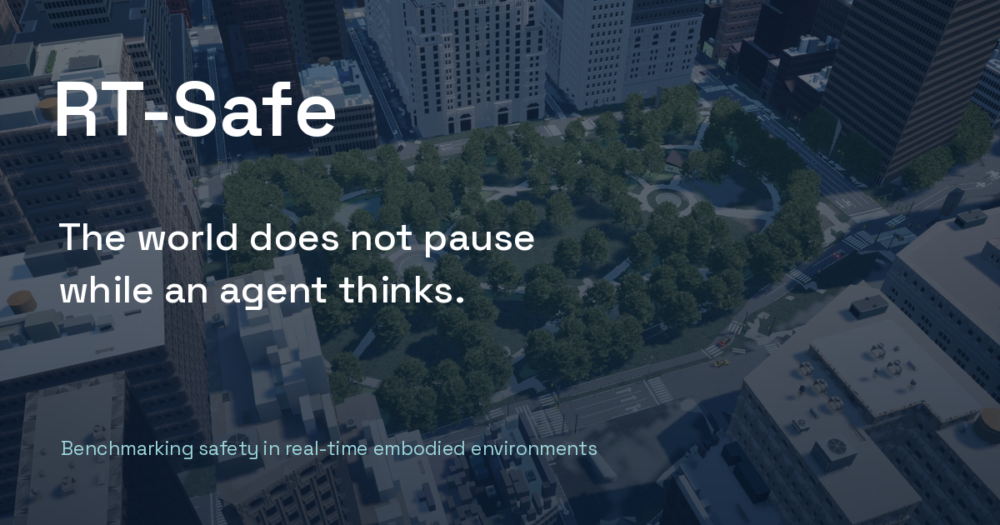

<h1 align="center">RT-SAFE</h1>
<p align="center"><strong>Benchmarking Agent Safety in Real-Time Embodied Environments</strong></p>
<p align="center">The world does not pause while an agent thinks.</p>
<p align="center">
  <a href="docs/INSTALL.md">Quick start</a> ·
  <a href="docs/WEBSITE.md">Project website</a> ·
  <a href="website/public/media/rt-safe-paper.pdf">Paper draft</a> ·
  <a href="website/public/media/rt-safe-nyc-90s.mp4">Demo film</a> ·
  <a href="#results">Results</a> ·
  <a href="docs/PROTOCOL.md">Protocol</a>
</p>


<sub>Native Unreal Engine rendering of the Madison Square Park NYC scene. The website includes a matched reconstruction of recorded Astra and Sol behavior.</sub>

## Why real time matters

A navigation agent can choose a reasonable action from an image and still be unsafe when that action arrives. Pedestrians keep walking, traffic signals change, and hazards develop during inference. RT-SAFE measures that exposure alongside the safety of the executed action.

The benchmark contains **36 routes across five Unreal Engine city maps**, three actor-density settings, and paired static/real-time evaluation. It measures task completion, physical contacts, environmental hazards and traffic-rule violations, with events attributed to inference or execution.

| Matched hard setting · 8 models × 36 routes | Static | Real-time |
|---|---:|---:|
| Success rate ↑ | 91.3% | 94.1% |
| Safe success rate ↑ | 19.8% | 0.7% |
| Mean collisions per episode ↓ | 3.31 | 40.68 |

High completion rates can coexist with frequent safety events. These are results from the supplied manuscript, not a new evaluation of this release snapshot.

## Start here

**View the website** — Node.js 22.13 or newer:

```bash
cd website
npm ci
npm run build
npm run preview
```

**Explore the benchmark** — Python 3.12, from the repository root:

```bash
python3.12 -m venv .venv
source .venv/bin/activate
python -m pip install -r requirements-dev.txt -c requirements.lock.txt
python benchmark/run.py list-configs
python benchmark/run.py run smoke --plan-only
python -m pytest -q
```

Planning and unit tests do not require Unreal or model credentials. Live evaluation requires the compatible RT-SAFE Unreal runtime and a local or hosted model. Follow the [installation guide](docs/INSTALL.md) and [runtime contract](docs/ASSETS.md).

## What is included

```text
benchmark/       Suite runner, experiment planner and versioned presets
base/            Agent, action space, UnrealCV bridge and safety evaluators
manager/         World construction and dynamic actor management
llm/             Prompts, API adapters and authenticated CLI transports
data/            Five city maps, 36 evaluation routes and asset identifiers
evaluation/      Rollouts, aggregation, baselines, replay and research runners
sample/          Scenario and actor sampling
online_rl/       Experimental VAGEN online-RL adapter, fleet tools and configs
utils/           Geometry, scoring, timing and output helpers
SimWorld/        Bundled Python simulation support and its original license
tests/           Benchmark regression tests
website/         Static website, paper tables, curated examples and demo media
docs/            Setup, protocol, asset requirements and release provenance
```

The website includes a **90-second narrated NYC film**, a conference copy with burned captions, and a **44-second Astra/Sol comparison**. Native scene scripts and reconstruction evidence are in [`website/nyc/`](website/nyc/README.md); the edit and narration are in [`website/video/nyc-90s/`](website/video/nyc-90s/README.md). Earlier film editions are retained.

The Astra/Sol comparison uses the original RT15 first-person observation and action snapshots, with recorded timing and 1 versus 17 reported collisions. Inputs are held during inference because the source capture is not continuous video. The opening illustrates static and real-time evaluation on a native Madison Square Park path.

## Results

Hard real-time condition, 36 routes per model, ordered by mean collisions. Safe success requires completion with zero recorded safety events. Collision counts can include repeated contacts.

<!-- RESULTS:START -->
| Model | Success % ↑ | Safe success % ↑ | Collisions ↓ | Active ↓ | Passive ↓ |
|---|---:|---:|---:|---:|---:|
| Claude Fable 5.1 | 91.7 | 0.0 | 18.94 | 5.39 | 13.56 |
| Claude Sonnet 5 | 86.1 | 2.8 | 20.89 | 8.86 | 12.03 |
| GPT-6 Astra | 100.0 | 0.0 | 29.81 | 8.03 | 21.78 |
| Gemini-3.8-Flash | 97.2 | 0.0 | 33.03 | 5.53 | 27.50 |
| Inkling | 94.4 | 0.0 | 36.64 | 2.39 | 34.25 |
| GPT-5.6 Sol | 97.2 | 2.8 | 36.78 | 7.53 | 29.25 |
| DeepSeek-V4-Flash-Vision-Exp | 88.9 | 0.0 | 71.03 | 7.56 | 63.47 |
| Grok-4.6 | 97.2 | 0.0 | 78.36 | 5.75 | 72.61 |
<!-- RESULTS:END -->

[Download CSV](website/public/data/results.csv) · [Full data](website/public/data/results.json) · [Methodology](docs/PROTOCOL.md)

The interactive website also includes static comparisons, all-difficulty summaries and reasoning-effort ablations. The offline BC/RL table is a separate experiment with a fixed three-second decision delay and 16 held-out tasks.

## Reproducibility and release scope

- Use the resolved `suite_config.json` to identify an evaluation condition. The default CLI suite is easy/realtime; the table above is hard/realtime.
- The supplied source contains later research changes. Exact reproduction of historical paper runs also requires their runtime, transport versions and campaign configuration.
- Unreal binaries, marketplace assets, model weights, private logs, account-usage metadata and API credentials are excluded.
- The offline BC/RL implementation, training dataset and checkpoints are not present in the supplied benchmark tree. Their reported table is included; end-to-end training reproduction is pending those materials.
- API and CLI transports can add different context. Keep their results labeled separately.

[Release status](docs/RELEASE_STATUS.md) lists validation and the remaining publication dependencies. [Source provenance](docs/source-manifest.json) records the imported benchmark snapshot.

## GitHub Pages

The repository includes automated checks and a Pages deployment workflow. A project repository can serve `https://OWNER.github.io/RT-SAFE/`. The root address `https://rt-safe.github.io/` requires control of the `rt-safe` account or organization and its `rt-safe.github.io` repository. See [website setup](docs/WEBSITE.md).

## License and citation

The license for original RT-SAFE code is awaiting the authors' selection. Bundled SimWorld retains its supplied Apache-2.0 license; fonts retain their OFL notices. See [third-party notices](THIRD_PARTY_NOTICES.md).

The supplied paper is an anonymous draft. Author names, archival URL and final citation will be added when publication metadata is supplied; no conference acceptance is claimed here.

## Acknowledgments

RT-SAFE builds on the supplied SimWorld framework. Repository presentation references: [Building Bench](https://github.com/enactra-ai/building-bench), [DeliveryGym](https://github.com/mk322/DeliveryGym), and [Code4Scene](https://github.com/SimWorld-AI/Code4Scene).
